# Customers Table – Architecture & Re-use Guide

> This document walks through every moving part that powers the **Customers** table inside `src/features/dashboard/pages/customers`.  It explains how filtering, sorting, pagination, column rendering and actions are stitched together with **TanStack Table v8** (previously _react-table_), **ShadCN/UI** components and custom React hooks.  You can follow the same blueprint to bootstrap rich, data-driven tables anywhere else in the code-base or in future projects.

---

## 1. High-level file map

| Layer | File(s) | Responsibility |
|-------|---------|----------------|
| **Route page** | `src/app/dashboard/customers/page.tsx` | Next.js entry-point – imports `<CustomersPage>` so the feature lives behind `/dashboard/customers`. |
| **Feature wrapper** | `src/features/dashboard/pages/customers/index.tsx` (`<CustomersPage>`)| Composes Filters + Table, fetches state from `useCustomers`. |
| **State & data** | `src/features/dashboard/pages/customers/hooks/use-customers.ts` | Central hook that holds **filters**, **sorting**, **pagination** state, transforms the raw dataset and exposes callbacks. |
| **Mock data** | `data/mock-customers.ts` | Temporary in-memory dataset (replace with API call later). |
| **Domain types** | `types/customer.ts` | `Customer`, `CustomerStatus`, `CustomerFilters`. |
| **UI  – Filters** | `components/customers-filters.tsx` | Search field, status dropdown, date-range picker. Updates `useCustomers` via props. |
| **UI  – Table** | `components/customers-table.tsx` | Thin presenter around `TanStack Table`. Receives already-filtered data & delegates page / sort events upward. |
| **UI  – Table helpers** | • `customers-table-columns.tsx` <br/>• `customers-table-header-cell.tsx` <br/>• `customers-table-pagination.tsx` | Column definitions (with custom cells), sortable header renderer, and pagination controls. |
| **Row actions** | `components/customers-actions-dropdown.tsx` | Contextual dropdown with view/edit/delete etc. |

> **Why this split?** Logic & state live in the hook, keeping UI components 100 % presentational.  This makes the pattern portable and testable.

---

## 2. Data flow diagram

```mermaid
flowchart LR
  route[Next.js route
  /dashboard/customers]
  route --> page[<CustomersPage>]
  page -->|uses| hook[useCustomers]
  hook -->|returns| filters_state[filters · sorting · pagination]
  hook -->|returns| data[paginated & sorted customers]
  page --> filtersUI[<CustomersFilters>]
  filtersUI -->|on change| hook
  page --> tableUI[<CustomersTable>]
  data --> tableUI
  tableUI --> headerCell[Header cell]
  tableUI --> paginationComp[Pagination]
  headerCell -->|sort| hook
  paginationComp -->|page change| hook
```



---

## 3. `useCustomers` hook – single source of truth

Key points (see the source for reference):

1. **Initialisation**
   ```ts
   const [filters, setFilters] = useState<CustomerFilters>({
     status: 'all', search: '', dateRange: { from: undefined, to: undefined }
   });
   const [sorting, setSorting] = useState<SortingState>([{ id: 'dateJoined', desc: true }]);
   const [pagination, setPagination] = useState<PaginationState>({ pageIndex: 0, pageSize: 10 });
   ```
2. **Filtering** – runs inside a memoised function so work is done only when dependencies change.  Status, search text and date-range are supported.
3. **Sorting** – handled *manually* (not by TanStack) so we can reuse the same hook for server-side tables later.  The `compareValues` helper safely compares numbers, strings & ISO dates.
4. **Pagination** – cap results using array slice once the list is filtered (& optionally sorted).
5. **Callbacks** – `updateFilters`, `handleSortingChange`, `handlePaginationChange`, `handleClearFilters` bubble events from UI back to state.
6. **Return value** – Hook emits both `allCustomers` (filtered only) and `customers` (filtered+sorted+paginated) together with `pageCount` so presenters can stay dumb.

> 🔄  If you later switch to server data, you only need to replace the memoised transformations with API requests while keeping the UI unchanged.

---

## 4. Building the table with TanStack Table

```tsx
const table = useReactTable({
  data: props.customers,        // already processed
  columns,                     // from useCustomerColumns()
  state: { sorting, pagination },
  pageCount: props.pageCount,  // manual mode
  onSortingChange: props.onSort,
  onPaginationChange: props.onPaginationChange,
  getCoreRowModel: getCoreRowModel(),
  getSortedRowModel: getSortedRowModel(),
  manualPagination: true,
  manualSorting: true,
});
```

Highlights:
* `manualPagination` / `manualSorting` keep the table controlled by the hook.
* We could enable `manualFiltering` the same way if we outsourced filtering to the server.
* Column & cell renderers use ShadCN utility classes for quick styling.

### Column definition pattern

Each `ColumnDef<Customer>` lives in `customers-table-columns.tsx` using `useMemo` so the function instance is stable:

```ts
{
  accessorKey: 'fullName',
  header: 'Contact',
  cell: ({ row }) => (
    <div className="flex flex-col">
      <span>{row.getValue('fullName')}</span>
      <span className="text-sm text-muted-foreground">{row.original.email}</span>
    </div>
  ),
},
```

*Use this exact shape when making new tables – only change the generics & renderers.*

### Sortable headers

`<CustomersTableHeaderCell>` inspects `header.column.getCanSort()` and shows chevron icons that reflect `header.column.getIsSorted()`.  The pattern is generic – copy/paste for other entities.

### Pagination controls

`<CustomersTablePagination>` receives the *table instance* and calls TanStack helpers (`nextPage()`, `setPageSize()` …).  It also displays a convenient "Rows per page" select.

---

## 5. Filters UI

`<CustomersFilters>` is a simple controlled form:

* **Search** input (with `<Search>` icon).
* **Status** dropdown powered by ShadCN `<Select>`.
* **Date-range** – re-uses shared `DatePickerWithRange` component.

Because the component gets `filters` & `onFiltersChange` from its parent, it stays fully stateless.

> 💡  Add more fields (e.g., _Location_, _Total Spent range_) by extending `CustomerFilters` type + updating the memoised filter logic.

---

## 6. Row actions

The `CustomerActionsDropdown` is optional but shows how to append contextual menus per row.  It receives the entire `customer` object so you can navigate to other pages or open dialogs.

Pattern to reuse:

```tsx
cell: ({ row }) => <EntityActionsDropdown entity={row.original} />
```

---

## 7. Adapting the pattern to new tables

1. **Scaffold files** – Duplicate the `customers/` folder and rename to `orders/`, `leads/`, etc., adjusting imports.
2. **Define types & mock data** – Create `types/{entity}.ts` and `data/mock-{entity}.ts`.
3. **Build hook** – Copy `use-customers.ts` → `use-{entity}.ts`; tweak filtering logic.
4. **Columns** – Update `use{Entity}Columns` with accessors & custom cells.
5. **Filters component** – Keep the layout pattern; adapt dropdown options.
6. **Page wrapper** – Compose filters + table exactly like `<CustomersPage>`.
7. **Route file** – Create `src/app/dashboard/{entity}/page.tsx` and export the feature page.

> **Tip:** Because everything is typed, genericising the hook and table is straightforward (e.g., `createDataTable<T>()`).  For now duplicating is fast enough.

---

## 8. Going further

* **Server-side data:** Switch `initialCustomers` to fetcher (SWR/React-Query).  Keep the manual flags on the table and request new pages/sorts.
* **Infinite scrolling:** Replace pagination slice with cursor pagination & `useIntersectionObserver`.
* **Column visibility / density toggles:** TanStack has built-in column visibility state you can expose via dropdown.
* **Export / Import:** The project already contains a placeholder under `customers/import-export` – integrate CSV or XLSX using libraries like `papaparse`.

---

### TL;DR – Checklist for a new table

- [ ] Domain type & mock/API data
- [ ] `use{Entity}` hook holding filter+sort+page state
- [ ] `{Entity}Filters` controlled component
- [ ] `use{Entity}Columns` list of `ColumnDef`
- [ ] `{Entity}Table` wrapper with TanStack, header & pagination helpers
- [ ] Feature page that wires everything together

Follow the checklist and you'll spin up production-ready tables in minutes 🚀.
