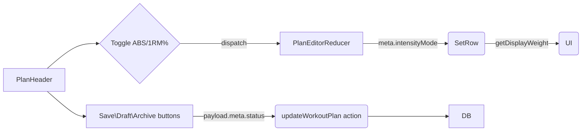

# Workout Plan Editor – Detailed Implementation Roadmap

## 1. Feature Overview
The goal is to finalise the Workout-Plan Editor by adding:
1. Intensity Mode **Toggle** (Absolute KG/LB ↔️ Percentage of 1-RM).
2. **Save** (Publish), **Draft**, **Archive** workflow tied to `workout_plans.status`.
3. Seamless **display** of plans (`app/training/plans/page.tsx`) & **editing** (`app/training/plans/[id]/page.tsx`).
4. Robust form submission via the reusable `useAction` hook.

---

## 2. Domain & Database Recap
```pgsql
workout_plans(
  id uuid PK,
  name text,
  intensity_mode intensity_mode DEFAULT 'ABSOLUTE', -- ABSOLUTE | PERCENT
  status workout_plan_status DEFAULT 'DRAFT',       -- DRAFT | PUBLISHED | ARCHIVED
  -- ...meta fields
)

workout_set_instructions(
  id uuid PK,
  exercise_id uuid FK,
  reps int,
  intensity numeric, -- meaning depends on workout_plans.intensity_mode
  -- ...
)

client_max_lifts(
  id uuid PK,
  client_id uuid FK,
  list_exercise_id uuid FK, -- 1-RM reference
  max_weight numeric,
  unit weight_unit
)
```

➜ **Key rule**: When `intensity_mode = 'PERCENT'`, the UI must display `Weight = intensity % × client 1-RM`. Persist the raw `intensity` (percentage) in DB; compute absolute KG/LB only in UI.

---

## 3. UI/UX Specification
1. **PlanHeader** additions
   • Status badge (colour-coded).  
   • "Save", "Draft", "Archive" buttons.  
   • Intensity toggle (`Switch` from shadcn): labels **ABS** / **1-RM %**.

2. **WeekAndDaySelector** – no change.

3. **ExerciseContainer** / **SetRow**
   • Read `intensity_mode` from `PlanEditorContext.meta`.  
   • Show an extra small text under weight column when `PERCENT`, e.g. `75 % → 90 kg`.

4. **Plans page (`/training/plans`)**
   • Add status filter tabs (All | Draft | Published | Archived).  
   • Card badge shows current status.

---

## 4. State Management Changes
### PlanEditorContext.meta (types `PlanEditorMeta`)
```ts
interface PlanEditorMeta {
  // ...existing
  intensityMode: 'ABSOLUTE' | 'PERCENT';
  status: 'DRAFT' | 'PUBLISHED' | 'ARCHIVED';
}
```
• Add actions: `TOGGLE_INTENSITY_MODE`, `SET_STATUS`.

### Reducer logic
```ts
case 'TOGGLE_INTENSITY_MODE':
  draft.meta.intensityMode = draft.meta.intensityMode === 'ABSOLUTE' ? 'PERCENT' : 'ABSOLUTE';
  break;
case 'SET_STATUS':
  draft.meta.status = action.payload; // 'DRAFT' | 'PUBLISHED' | 'ARCHIVED'
  break;
```

---

## 5. Data Flow & Calculations
1. **Absolute ➡️ Percent** is *not* automatically converted when toggling (data integrity). Existing `intensity` values remain; interpretation changes.
2. **Display helper**
```ts
export const getDisplayWeight = (intensity: number, mode: 'ABSOLUTE'|'PERCENT', oneRM?: number) =>
  mode === 'ABSOLUTE' ? `${intensity} kg` : oneRM ? `${intensity}% → ${(intensity*oneRM/100).toFixed(1)} kg` : `${intensity}%`;
```
3. Fetch `client_max_lifts` once when opening a plan (server component) and provide via context.

---

## 6. Server Actions
### 6.1 `updateWorkoutPlan.action.ts`
*Input*
```ts
{
  id: string;
  meta: PlanEditorMeta;
  weeks: WeekInPlan[];
}
```
*Flow*
1. Validate via Zod.
2. Authorisation.
3. Upsert `workout_plans` + nested days/exercises/sets via Prisma transaction.
4. Return `data` or `error`.

### 6.2 `archiveWorkoutPlan.action.ts`
   – Thin wrapper that sets `status: 'ARCHIVED'`.

---

## 7. Form Handling with `useAction`
In `EditPlanForm`:
```ts
const { execute, isLoading, fieldErrors } = useAction(updateWorkoutPlan, {
  onSuccess: () => router.push(`/training/plans/${plan.id}?success=Saved`),
});

const onSubmit = () => execute(serializeEditorState(state));
```
• Buttons map to payload:
```html
<Button variant="outline" onClick={() => execute({...payload, meta: {...payload.meta, status: 'DRAFT'}})}>Save as Draft</Button>
<Button onClick={() => execute({...payload, meta: {...payload.meta, status: 'PUBLISHED'}})}>Publish</Button>
<Button variant="destructive" onClick={archivePlan}>Archive</Button>
```

---

## 8. Step-by-Step Implementation Guide
1. **Types & DB sync**
   a. Update `types/workout-plans-create/editor-state.ts`.  
   b. Confirm Prisma schema mirrors enum defaults; generate migration.

2. **Context & Reducer** – add new meta fields & actions.

3. **Helper util** `getDisplayWeight` in `utils/weight.ts`.

4. **PlanHeader.tsx** – integrate toggle & buttons; dispatch actions.

5. **ExerciseContainer / SetRow** – use helper to show weight.

6. **Server actions** – create `updateWorkoutPlan.action.ts` + `archiveWorkoutPlan.action.ts` following pattern in `create-safe-action.ts`.

7. **Pages**
   • `/training/plans/page.tsx`: add status filter & pass to `getWorkoutPlans` action.  
   • `/training/plans/[id]/page.tsx`: inject fetched 1-RM map (client → exercise → weight) into context provider.

8. **Testing**
   • Unit test `getDisplayWeight`.  
   • Integration test server action with mock Prisma.

9. **QA Edge Cases**
   • 1-RM missing ⇒ display just `%` with tooltip.  
   • Toggling mode after editing should *not* mutate existing intensities.

10. **Docs & Clean-up** – update README & MIGRATION_GUIDE.

---

## 9. Visual References


---

## 10. Next Steps
Implement **types & reducer** first to unblock UI, then progress following the above sequence.

> Happy coding! 🚀
