Ran tool

Ran tool
Below is a visual that shows exactly why the component kept re-rendering and how `useMemo` (or any technique that stabilises the reference) stops the loop.

```mermaid
flowchart TD
    %% Without useMemo
    subgraph A["Without useMemo"]
        R1[Render #1]
        O1[Create new options object]
        UA1[useAction → new execute]
        E1[useEffect detects change]
        F1[fetchSubscriptions]
        S1[setState → re-render]
        R2[Render #2]
        R1 --> O1 --> UA1 --> E1 --> F1 --> S1 --> R2
        O2[New options object again]
        UA2[useAction → new execute]
        E2[useEffect triggers again]
        R2 --> O2 --> UA2 --> E2 --> F1
        R3((...continues loop...))
        E2 --> R3
    end

    %% With useMemo
    subgraph B["With useMemo"]
        R1F[Render #1]
        OptMemo[useMemo → stable options]
        UA1F[useAction → stable execute]
        Eff1[useEffect runs once]
        Fetch1[fetchSubscriptions]
        State1[setState]
        R2F[Render #2]
        R1F --> OptMemo --> UA1F --> Eff1 --> Fetch1 --> State1 --> R2F
        R2F --> OptMemo
        UA1F --> EffSkip[useEffect sees no change → skips]
    end
```



### What was happening

1. Each render created a **new `{ onSuccess, onError }` object**.
2. `useAction` treats that as *new props*, so `execute` is recreated.
3. `useEffect` depends on `fetchSubscriptions` (i.e., `execute`).  
   A new function → **dependency changes** → effect runs again.
4. Inside the effect we call `fetchSubscriptions`, set state, and trigger **another render**.
5. Loop repeats ⇒ lots of `/settings` requests.

### How `useMemo` (or `useCallback`) fixed it

1. We wrap the callbacks in `useCallback` and **wrap the options object in `useMemo`**:
   ```ts
   const actionOptions = useMemo(() => ({ onSuccess, onError }), [onSuccess, onError]);
   ```
   `actionOptions` now keeps **the same reference** between renders.
2. `useAction` therefore **receives the same options reference** ⇒ `execute` doesn’t change.
3. The dependency array `[userId, fetchSubscriptions]` in `useEffect` is stable, so the effect fires **only when `userId` changes**, not every render.
4. Result: a single network call and no infinite re-renders.

In short, stabilising references with `useMemo`/`useCallback` prevents React from thinking your dependencies have changed, stopping the render loop.